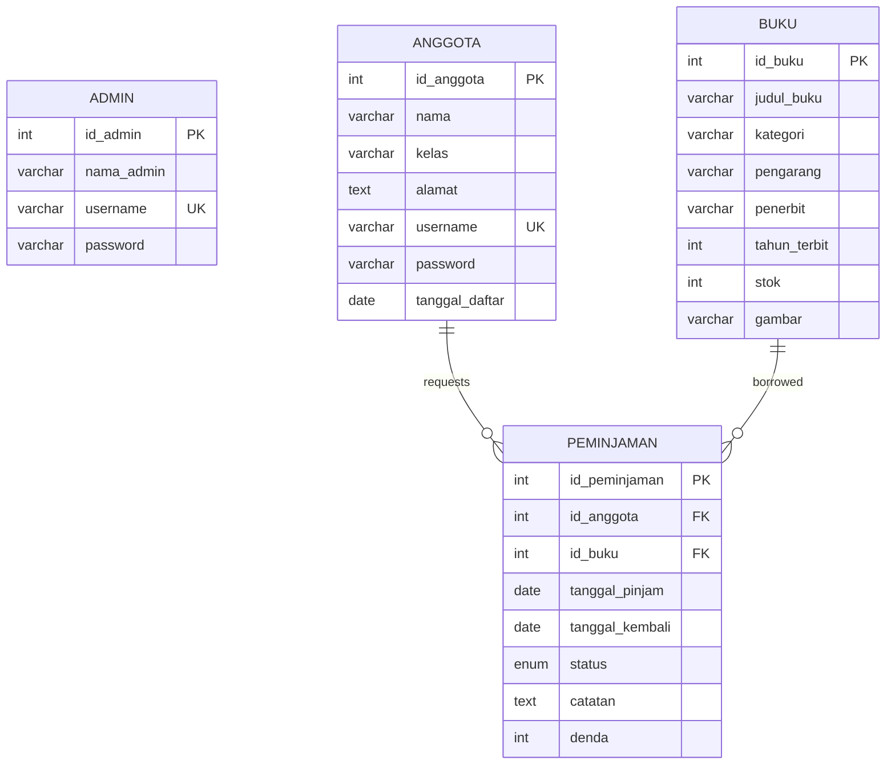

# 📚 Bookavy - Glassmorphism Library Information System

**Bookavy** is a library information system web application built using **Native PHP** and a **MySQL** database. It is designed with a premium, modern user interface utilizing the **Glassmorphism** concept (blur background effects), inspired by contemporary Laravel and Tailwind CSS design guidelines.

This application is ideal for study projects, vocational competency tests (UKK), or as a starting template for school library management software.

---

## ✨ Key Features

### 🧑‍💻 Administrator Features (Admin Panel)
*   **Real-time Dashboard**: Live summary cards showing total books, total members, active transactions, and currently borrowed books count.
*   **Book Management (CRUD)**: Create, read, update, and delete books, including a secure **book cover upload** feature.
*   **Member Management (CRUD)**: Manage student/member accounts.
*   **Loan & Return Verification**:
    *   Approve or reject book loan requests from members (automatically manages book stock levels).
    *   Verify book returns and **automatically calculate late return fines** (configured at Rp 1,000 / day).
*   **Manual Recording**: Ability to manually register a book loan directly from the admin panel.

### 👥 Member Features (Student Portal)
*   **Interactive Catalog**: Search for books by title or author, and filter results by category.
*   **Self-Loan Request**:
    *   Students can request to borrow books directly from the online catalog.
    *   Maximum limit of **3 active borrowed books** per user.
    *   Maximum borrowing duration is **14 days**.
    *   Book stock is instantly reserved upon request to prevent double-booking.
*   **Real-time Status Tracking**: Monitor loan status stages (`Pending`, `Borrowed`, `Return Pending`, `Returned`).
*   **Self-Return Request**: Submit a request to return borrowed books for admin verification.
*   **Request Cancellation**: Cancel any pending borrow requests (instantly restoring the book stock to the catalog).

---

## 🎨 Aesthetics & Design Elements
*   **Glassmorphic UI**: Transparent glass-like panels with backdrop blur (`backdrop-filter`) for a premium design layout.
*   **Harmonious Color Palette**: Built with lavender shades and soft radial gradients (`#e8e4fb`, `#fedcb2`, `#c6bfff`).
*   **Premium Typography**: Uses the modern **Outfit** typeface imported from Google Fonts.
*   **Smooth Animations**: Fluid hover effects and transitions on cards, buttons, inputs, and the sidebar navigation.

---

## 🛠️ System Requirements
Ensure your local environment meets the following requirements:
*   **PHP** >= 8.0
*   **MySQL** or **MariaDB**
*   **Apache** or **Nginx** (or PHP built-in CLI server)
*   PHP Extensions: `PDO_MySQL`, `GD` (optional, for image processing)

---

## 🚀 Installation & Setup Guide

### 1. Database Setup
1.  Open your MySQL client application (e.g., phpMyAdmin, DBeaver, HeidiSQL, or MySQL Terminal).
2.  Import the database setup file [schema.sql](file:///d:/ukk-php-native/schema.sql) located at the root of this project.
    ```sql
    -- The schema.sql file will automatically create the database 'perpus', setup the tables, and seed initial test data.
    SOURCE d:/ukk-php-native/schema.sql;
    ```

### 2. Configure Database Credentials
Edit the database connection details in [config.php](file:///d:/ukk-php-native/config.php) to match your local setup:
```php
define('DB_HOST', '127.0.0.1');
define('DB_PORT', '3306');
define('DB_NAME', 'perpus');
define('DB_USER', 'root');
define('DB_PASS', ''); // Set your database password if applicable

// Base URL of your application
define('BASE_URL', 'http://localhost:8080');
```

### 3. Book Cover Upload Directory
Ensure the folder `uploads/books/` is writable by your web server. The system will automatically create it upon the first image upload.

### 4. Running the Local Server
You can run Bookavy using either the **PHP Built-in Server** or a suite like **XAMPP / Laragon**:

*   **Using PHP Built-in Server (Recommended)**:
    Open your terminal/command prompt at the project root directory and run:
    ```bash
    php -S localhost:8080
    ```
    Then open your browser and navigate to: `http://localhost:8080`

*   **Using XAMPP**:
    Move or copy the `ukk-php-native` folder into your `htdocs` directory (typically `C:/xampp/htdocs/`). Start Apache and MySQL in your XAMPP Control Panel, then access `http://localhost/ukk-php-native` (ensure `BASE_URL` in `config.php` matches this path).

---

## 🔑 Demo Account Credentials

Once the `schema.sql` file has been imported, you can log in using these default accounts:

| Role | Username | Password | Access Details |
| :--- | :--- | :--- | :--- |
| **Administrator** | `admin` | `admin123` | Complete book management, member management, & transaction verifications |
| **Member (Student)** | `anggota` | `anggota123` | Book catalog access, self-loan, and return requests |

---

## 📊 Database Schema & Relationships

The database schema consists of 4 main tables:

1.  **`admin`**: Stores credentials and details for library administrators.
2.  **`anggota`**: Stores profile information and login details for library members.
3.  **`buku`**: Stores book data, stock count, categories, and cover image paths.
4.  **`peminjaman`**: Manages transactions. It relates the `anggota` and `buku` tables with foreign keys configured on `ON DELETE CASCADE` to maintain data integrity.



---
*Created with ❤️ for smooth and aesthetic school library management.*
